# Spec Kit

<p align="center">
  <a href="https://github.com/liuminxin45/spec-kit"></a>
  
  
  <a href="LICENSE"></a>
</p>

Spec Kit 是一个面向 Codex 的 AI Coding 工作流工具包。它把规格驱动开发、低上下文任务路由、AI 自我验收、知识包和工程验证脚本放在同一套可复制流程里。

它适合这些场景：

- 让 Codex 先写清规格和计划，再动代码。
- 小修复走轻流程，大风险变更走硬门禁。
- 把项目知识从开源核心中剥离，按需挂载到目标项目。
- 让 AI 在交给人验收前先用构建、测试、日志、浏览器或 CDP 证据自验。

当前 AI 自我验收最擅长处理支持 CDP 协议的 UI 框架，例如 Electron、Chromium、WebView 或可通过 Chrome DevTools 观察的前端运行时。它可以读取 DOM、console、network、computed style、截图和运行时状态。非 CDP UI、真实设备或原生宿主仍可走测试、日志、设备门禁或人工验收，但缺少可验证证据时必须记录为 BLOCKED，不能假装通过。

## 开源声明

本项目借鉴了 GitHub 官方 [github/spec-kit](https://github.com/github/spec-kit) 的源码结构和 Spec-Driven Development 工作流思想，并在此基础上面向 Codex、分层知识库、capability pack、项目资产升级和自动化门禁做了工程化扩展。本仓库不是 GitHub 官方项目；若上游项目许可证或声明有更新，应以其官方仓库为准。

Project-specific facts belong in workspace-local `ai/knowledge/` or portable capability packs. 开源核心只保留通用流程、模板和脚本，不应写入某个团队、业务、宿主、插件、设备或私有仓库的事实。

## 和官方 Spec Kit 的区别

官方 Spec Kit 的主线是通用 Spec-Driven Development：先把想法写成 spec，再生成 plan、tasks，最后 implement。这个仓库保留这个思想，但把它收敛成 Codex-only 的工程交付系统。

当前对齐基线为 `upstream_baseline: github/spec-kit@v0.12.5`；本仓库版本独立演进，当前本地版本线为 `0.10.2`，不冒用官方 `0.12.x` 版本号。

| 维度 | 官方 `github/spec-kit` | 本仓库 | 主要优势 |
| --- | --- | --- | --- |
| 定位 | 通用 SDD 起步工具 | Codex-only AI 交付流程 | 少一个集成选择层，默认路径更清楚 |
| 主流程 | Specify -> Plan -> Tasks -> Implement | 按风险选择 micro-fix / bugfix-lite / bugfix / full-sdd / investigation / validation-only | 小事不被重流程拖慢，大事不跳过门禁 |
| 上下文 | 主要依赖规格文档和项目上下文 | 默认只读 AGENTS、workspace、repository map、task routing，再按需加载知识和门禁 | 降低过量上下文和陈旧知识污染 |
| AI 验收 | 更偏 SDD 执行框架 | `acceptance-rubric.md` + `speckit-ai-self-acceptance` + build/test/CDP/browser/log/runtime evidence | 人工验收前先让 AI 给出 PASS / FAIL / BLOCKED |
| UI 证据 | 由项目自行补充 | 对 Electron/CDP 友好，支持 host CDP、截图、DOM/CSS/console 证据链 | 更适合桌面宿主、插件前端和可调试 UI |
| 项目知识 | 通常放在项目文档里 | `ai/knowledge/` 可 bootstrap、generate-pack、apply、update、uninstall、repack | 知识可审查、可迁移、可卸载 |
| 闭环 | 实现后由团队自行收口 | 默认保留 `validation.md`、`implementation-summary.md` 和人工验收；converge、retrospective、workflow observer、commit、post-commit self-check、rubric-score 为 opt-in | 默认上下文更小，仍保留可追溯交付事实 |
| Git 策略 | 项目自行约定 | 默认本地分支、PR-first、不直接 push | 降低误推和远端污染风险 |

```mermaid
flowchart LR
    subgraph Official["官方 github/spec-kit"]
      direction TB
      O1["Idea"] --> O2["Specify"]
      O2 --> O3["Plan"]
      O3 --> O4["Tasks"]
      O4 --> O5["Implement"]
      O5 --> O6["Human validation"]
    end

    subgraph ThisRepo["本仓库 spec-kit"]
      direction TB
      T1["User request"] --> T2["Risk/profile routing"]
      T2 --> T3["Minimal spec/plan/workpack"]
      T3 --> T4["Implement"]
      T4 --> T5["Validation + implementation summary"]
      T5 --> T6["Human acceptance"]
      T6 -. "opt-in governance" .-> T7["Converge / retrospective / commit"]
    end

    O6 -. "Codex 工程化扩展" .-> T1
```



## 快速开始

### 环境要求

- Python 3.11+
- PowerShell
- Git
- `uv`
- Codex

如果需要 Electron/CDP UI 自验，再准备可连接的 Chrome DevTools MCP 或宿主调试端口。

### 安装 CLI

在本仓库根目录执行：

```powershell
pwsh -NoProfile -File .\scripts\powershell\install.ps1
```

开发本仓库时可用 editable 安装：

```powershell
pwsh -NoProfile -File .\scripts\powershell\install.ps1 -Editable
```

检查当前 CLI 和项目资产状态：

```powershell
specify --version
specify self check --project-dir . --json
```

`specify self upgrade` 是保留命令，当前版本不执行联网自动升级。更新 CLI 的推荐方式是重新运行 `install.ps1`。

卸载本机 CLI：

```powershell
pwsh -NoProfile -File .\scripts\powershell\uninstall.ps1
```

等价底层命令：

```powershell
uv tool uninstall specify-cli
```

### 初始化项目

进入目标项目根目录：

```powershell
specify init --here
```

当前开源版是 Codex-only，不再提供其它 AI 初始化路径。初始化后主要生成：

```text
AGENTS.md
.agents/skills/speckit-specify
.agents/spec-kit/skills
.specify/
ai/
specs/
```

在 Codex 里从入口 skill 开始：

```text
$speckit-specify
```

### 初始化时挂载知识包

如果已经有可分发知识包：

```powershell
specify init --here --knowledge-pack <pack-dir>
```

这会安装 pack、物化 `ai/knowledge/`、写入 lock，并验证知识索引。This path does not generate an AI review packet.

如果 pack 也应覆盖目标项目的 workspace profile 和 repository map：

```powershell
specify init --here --knowledge-pack <pack-dir> --knowledge-pack-apply-profiles
```

不加 `--knowledge-pack-apply-profiles` 时，会保留初始化生成的 `.specify/workspace.yml` 和 `.specify/memory/repository-map.md`。

## 常用命令

### 项目资产升级

预览升级：

```powershell
specify upgrade --project-dir <project-dir> --dry-run
```

应用当前安装版本的项目资产：

```powershell
specify upgrade --project-dir <project-dir>
```

从本地 Spec Kit 源码检出刷新项目资产：

```powershell
specify upgrade --project-dir <project-dir> --source <spec-kit-source-dir>
```

刷新 Codex 入口 skill 和内部阶段 skills：

```powershell
specify integration upgrade codex --force
```

诊断项目集成状态：

```powershell
specify integration status --json
```

升级会写入：

```text
.specify/spec-kit.lock.yml
.specify/integrations/speckit.manifest.json
```

`spec-kit.lock.yml` 记录项目使用的 Spec Kit 版本、来源和 managed asset manifest。`speckit.manifest.json` 记录 Spec Kit 管理的文件 hash；默认只刷新未被用户改过的 managed assets，确实要覆盖时再用 `--force`。

### 工作流执行

运行内置 workflow：

```powershell
specify workflow run speckit --input spec="修复发现页状态" --json
```

查看状态：

```powershell
specify workflow status <run-id> --json
```

继续运行：

```powershell
specify workflow resume <run-id> --json
```

当前内置 profile：

| Profile | 适用场景 | 主要产物 |
| --- | --- | --- |
| `micro-fix` | 1-3 个文件、低风险、根因明确的小修复 | `workpack.md` |
| `standard-bugfix-lite` | 低/中风险标准修复，想避免完整 SDD 负担 | `workpack.md` |
| `standard-bugfix` | 需要 `spec.md` + `plan.md` 的普通行为修复 | `spec.md`、`plan.md` |
| `full-sdd` | public API、架构、迁移、跨仓、真实设备、host/plugin/native 交付链 | `spec.md`、`plan.md`、`tasks.md` |
| `blocked-investigation` | 根因或验证条件不清楚 | `fact-pack.md` / investigation notes |
| `validation-only` | 只补验证证据，不改产品代码 | `validation.md` |

常规代码改动的默认闭环是：

```text
intake -> plan/workpack -> implement -> validation.md
-> implementation-summary.md -> acceptance -> human-acceptance
```

`spec.md`、`tasks.md`、`convergence.md`、retrospective、workflow observer、commit、post-commit self-check、rubric-score 和 complete-branch 都不是普通交付的默认产物或默认阶段；只有风险、范围或用户明确要求时才进入。

后续查看某个 feature “最终真正实施了什么”，优先看 `specs/<feature>/implementation-summary.md`。它是最终实施索引，记录实际方案、变更清单、机制变化、plan/spec 差异、未做事项、验证/验收摘要、残留风险和证据链接。

Bugfix 计划必须完成 Root-Fix 决策门禁：比较 root fix、mitigation、containment 和 compatibility fallback。清理、释放、reset、重试、fallback 或限制影响，只有在证据证明消除了失败机制时，才能被称为 root fix。

## 知识包

知识包用于把项目知识和可选能力从 Spec Kit 核心中移出去。一个 pack 可以包含：

```text
knowledge-pack/
├── knowledge-pack.yml
├── ai/knowledge/
├── capabilities/index.yml
├── skills/
├── tools/
├── scripts/
├── commands/
├── prompts/
├── resources/
├── hooks/
├── profiles/
└── evaluation/
```

安装或 compose pack 时不会自动执行 pack scripts。脚本必须由用户或 AI 在明确任务中按需调用，并输出结构化 `facts`、`blockers`、`unknowns`、`hints`。

### 没有知识包时

先生成可审查草稿：

```powershell
specify knowledge bootstrap --project-dir . --json
```

主要输出：

```text
.specify/knowledge-bootstrap/draft/ai/knowledge/
.specify/knowledge-bootstrap/ai-review/
```

`.specify/knowledge-bootstrap/ai-review/` 用于记录 source-read plan 和 claim ledger。AI 应补充 source refs、未知项和分层知识，而不是把机械扫描结果直接当成高质量知识库。

### 生成可分发知识包

创建 AI synthesis workspace 和 draft pack：

```powershell
specify knowledge generate-pack --project-dir . --pack-id <id> --include-profiles --json
```

AI 主要编辑：

```text
.specify/knowledge-pack-generation/ai-synthesis/ai/knowledge/
```

常见质量和等效性产物：

```text
.specify/knowledge-pack-generation/quality/source-coverage-ledger.json
.specify/knowledge-pack-generation/quality/claim-verification-report.json
.specify/knowledge-pack-generation/quality/synthesis-quality-summary.md
.specify/knowledge-pack-generation/equivalence/equivalence-summary.md
```

把 reviewed synthesis 导出为最终 pack：

```powershell
specify knowledge finalize-pack --project-dir . --pack-id <id> --include-profiles --json
```

导出后立即挂载到当前项目：

```powershell
specify knowledge finalize-pack --project-dir . --pack-id <id> --include-profiles --apply --force
```

单独评估 synthesis 质量：

```powershell
specify knowledge evaluate-synthesis --project-dir . --minimum-score 70 --fail-below-minimum --json
```

底层脚本包括 `generate-knowledge-pack.ps1`、`evaluate-knowledge-pack-synthesis.ps1` 和 `validate-knowledge-pack.ps1`，便于 CI 或排障复用。

### 挂载、更新、卸载

```powershell
specify knowledge apply-pack <pack-dir> --project-dir . --force --json
specify knowledge update-pack <pack-dir> --project-dir . --json
specify knowledge uninstall-pack <id> --project-dir . --json
```

安装审计记录位于：

```text
.specify/knowledge/records/<pack-id>.json
.specify/knowledge/records/index.json
.specify/knowledge/lock.yml
.specify/capabilities/lock.yml
```

### 导出、重打包、验证

导出现有知识：

```powershell
specify knowledge export-pack --project-dir . --source-knowledge-dir ai/knowledge --pack-id <id> --output-dir <pack-dir> --force --json
```

把当前项目里的 active knowledge 和 capability overlays 重新打包：

```powershell
specify knowledge repack --project-dir . --pack-id <id> --include-profiles --force --json
```

验证 pack：

```powershell
specify knowledge validate-pack <pack-dir> --json
```

提升 opt-in retrospective 中 approved 知识候选：

```powershell
specify knowledge promote-candidates --project-dir . --feature-dir specs/<feature> --json
```

提升后同时增量重打包：

```powershell
specify knowledge promote-candidates --project-dir . --feature-dir specs/<feature> --repack --pack-id <id> --force --json
```

## Spec Persistence 策略

默认持久化模型是 `flow-back`：

```yaml
spec_persistence:
  model: "flow-back"
  keep_feature_artifacts: true
  promote_only_with_human_approval: true
  durable_knowledge_target: "ai/knowledge"
  repack_after_approved_promotion: false
```

含义：

- feature artifacts 保留为交付证据。
- 长期经验先通过 opt-in retrospective 形成候选。
- 只有人工批准后才写入 `ai/knowledge`。
- 需要分发时再 repack 为知识包。

## 验证

修改 workflow、模板、生成上下文、知识索引或知识包相关能力后，运行：

```powershell
pwsh -NoProfile -File .\scripts\powershell\validate-generated-context.ps1 -RepoRoot . -Json
pwsh -NoProfile -File .\scripts\powershell\validate-knowledge-index.ps1 -RepoRoot . -Json
pwsh -NoProfile -File .\scripts\powershell\validate-context-budget.ps1 -RepoRoot . -Json
```

README 与知识包开局文档相关回归：

```powershell
python -m pytest tests/test_spec_delivery_workflow.py::test_open_source_readme_documents_pack_and_generated_knowledge_starts -q
```

全量测试：

```powershell
python -m pytest -q
```

## 项目结构

```text
src/specify_cli/        specify CLI 源码
scripts/powershell/     初始化、验证、知识包和工作流脚本
templates/              初始化模板、命令模板、AI 资产和内置 skills
workflows/              bundled workflow 定义
checklist-rules/        checklist 规则包
config/                 配置模板
tests/                  回归测试
TEAM-README.md          团队内部流程说明，默认不进入任务上下文
```

## FAQ

### 这个仓库会包含项目私有知识吗？

不应该包含。开源核心只放通用框架资产。项目事实、团队规则、仓库结构、领域约束和定制能力应放在目标项目本地 `ai/knowledge/`，或打成可挂载、可更新、可卸载、可重新打包的 capability pack。

### 它能完全自动验收 UI 吗？

不能保证。它目前对 Electron、Chromium、WebView 等 CDP-compatible UI 最有效。非 CDP 原生 UI、真实设备、外部服务和权限链路需要测试、日志、设备证据或人工验收配合；证据不足时应 BLOCKED。

### 知识包挂载后还能继续演进吗？

可以。用户在目标项目中补充或修正知识后，用 `specify knowledge repack --project-dir . --pack-id <id> --include-profiles --force --json` 重新打包，再分发给其它项目或团队。

### Pack scripts 会在安装时自动执行吗？

不会。安装和 compose 只发布命名空间化资产；脚本需要由 AI 或用户在明确任务中按需调用。

### Spec Kit 会直接 push 吗？

不会作为普通交付默认动作。默认是本地分支、AI 验证、`implementation-summary.md` 和人工验收；commit、post-commit self-check、rubric-score、complete-branch 都是 opt-in。push 在默认流程之外，应优先 PR-first；如确需例外直推，必须先通过 `preflight-push` 并取得明确人工批准。

## License

本仓库使用 [MIT License](LICENSE)。
