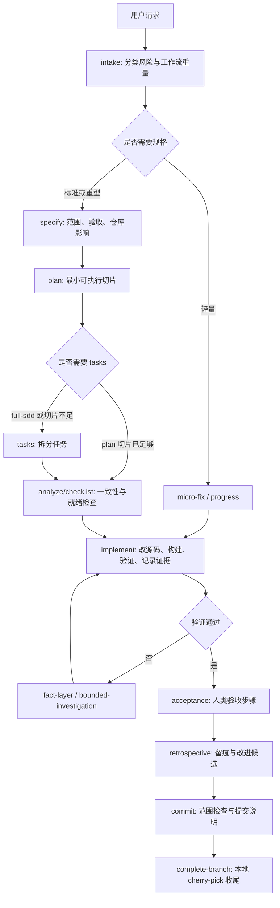

# Spec Kit for AI Delivery

面向真实工程交付的 Spec-Driven Development 工作流增强版。它基于
[github/spec-kit](https://github.com/github/spec-kit)，但重点不是再做一个
“从需求到代码”的通用入门流程，而是把 AI 编码放进可审计、可验证、可持续
改进的工程闭环里：小上下文启动、按风险升级、自动衔接阶段、源码优先修复、
运行态证据、自我验证、验收后再交给人类。

## GitHub 描述

企业级 Spec Kit 增强版：面向多仓库与 Electron/插件应用的 AI 交付工作流，内置小上下文知识层、自动阶段衔接、CDP 调试截图自验证、源码到运行态一致性和提交治理。

## 为什么需要这个版本

原版 Spec Kit 解决了一个很重要的问题：不要让 AI 直接从一句话开始写代码，
而是先把目标、约束和计划结构化。这个版本继续沿用这个方向，但把重心推进
到团队日常最容易失控的地方：

- AI 容易加载过多历史资料，导致上下文膨胀和旧事实污染。
- 阶段报告容易说“自动进入下一步”，但实际停在原地。
- UI 修复容易只改源码或只改运行时目录，没有证明真实宿主里已经生效。
- Electron/插件应用的真实行为取决于宿主容器、运行态资源、路由、窗口尺寸、
  DevTools target 和异步事件，单元测试或孤立预览经常不够。
- 多仓库工程里，AI 容易靠搜索猜仓库职责，改到错误层。
- 提交前缺少统一的证据、验收、范围、提交说明和分支收尾规则。

因此，这个仓库把 Spec Kit 从“规格驱动开发脚手架”扩展成“AI 交付控制面”：
它不是替代工程判断，而是约束 AI 先拿事实、按风险选路径、每一阶段有产物、
每次修改有验证、每个停顿有 blocker。

## 核心原则

### 1. 默认上下文小

每个任务启动时只读取稳定入口：

- `AGENTS.md`
- `.specify/workspace.yml`
- `.specify/memory/repository-map.md`
- `.specify/feature.json`，仅作为当前任务状态
- `ai/workflows/task-routing.md`

旧 specs、长期知识、工具策略、模板、设计历史都不默认加载。需要时通过
`select-knowledge` 或 `ai/knowledge/index.yml` 选择少量 guide。这样做的目标
是让 AI 的第一反应不是“全仓搜索”，而是先理解仓库边界、当前任务和路由规则。

### 2. 仓库职责有权威来源

多仓库项目不能靠 AI 搜索目录名来猜职责。`.specify/memory/repository-map.md`
是仓库角色、路径、能力归属和项目路径类别的权威来源。

这条规则尤其适合插件化、宿主应用、SDK、Native bridge、共享库并存的工程。
AI 必须先知道“应该改源码仓库、构建产物、运行时目录还是包产物”，再进入
具体文件。

### 3. 工作流按风险升级

不是每个问题都需要完整 SDD，也不是每个问题都能轻量跳过证据。本版本内置
几条工作流重量：

| 路径 | 适用场景 | 典型产物 |
| --- | --- | --- |
| `micro-fix` | 小范围、低风险、已有证据、可本地验证 | `progress.md` 或轻量记录 |
| `standard-bugfix` | 紧凑行为修复、多文件改动、状态或 UI 行为敏感 | `spec.md`、`plan.md`、可选 checklist |
| `full-sdd` | 公共 API、架构、迁移、跨仓库、真实设备语义、大范围边界变更 | `spec.md`、`plan.md`、`tasks.md`、`analysis.md`、checklist |
| `blocked-investigation` | 根因、运行态事实或验证条件不足 | `fact-pack.md`、调查证据 |
| `validation-only` | 不改产品代码，只补验证证据 | `validation.md` |

路由不靠关键词，而是结合风险、受影响仓库、边界类型、证据是否足够，以及
`.specify/feature.json` 的结构化状态。

### 4. 阶段必须真的自动衔接

“自动进入下一阶段”不是一句报告话术，而是执行契约。

当当前阶段完成，并且下一阶段结构上已知，AI 必须在同一轮继续执行下一阶段。
只有这些情况才能停下：

- 需要人工验收、澄清或 owner 决策
- 高风险操作需要确认
- 缺少设备、宿主、权限或工具
- 构建失败、验证失败、存在 blocker
- source/runtime delivery chain 没闭合
- 用户明确要求暂停

如果停下，报告里必须写 `blockers` 和 `next_required_human_action`。只说
“下一步会自动进入”但不执行，是不合规的。

### 5. 实现阶段拥有验证责任

`implement` 不只是写代码。它负责完成代码修改、构建、部署到必要运行态、
AI 自验证、记录证据。人类验收发生在 AI 技术验证之后，而不是替代 AI 的
 primary smoke。

对 host-embedded frontend plugin，固定链路是：

```text
source edit -> frontend build -> direct runtime replacement -> real host CDP verification
```

也就是说，AI 修改源码后，要构建前端产物，把构建结果同步到真实宿主加载的
运行时目录，然后通过真实 Electron 宿主的 CDP target 验证。只在源码目录
构建成功，或只打开孤立预览，都不足以证明真实产品 UI 已经修好。

### 6. Electron/CDP 是一等公民

这个版本对 Electron 宿主和插件 UI 有强约束：

- 优先启动或复用真实 Electron 宿主。
- 连接 `http://127.0.0.1:9222` 等 CDP endpoint。
- 先读取 `/json/list`，记录全部 page target 的
  `id/title/url/webSocketDebuggerUrl`。
- 选择真实业务 target，而不是 DevTools、空白页、base window 或插件工作台。
- 采集 screenshot、DOM、computed style、box metrics、console error。
- 模拟核心点击、hover、展开折叠、滚动、键盘等交互。
- UI/CSS/layout 第一次补丁失败后，第二次补丁前必须拿运行态 DOM/CSS/尺寸证据。

这让 AI 能在 Electron/插件应用里形成“观察 -> 修复 -> 构建 -> 部署 ->
截图/交互验证 -> 再修复”的闭环，而不是把调试责任过早交给人类。

### 7. 脚本给事实，LLM 做判断

脚本输出 `facts`、`blockers`、`unknowns`、`hints`。它们负责确定性工作：
查前置条件、选知识、检查 checklist、检测 CDP target、同步运行态资源、
校验源码/产物一致性、验证提交说明。

LLM 负责语义工作：路由、根因判断、验证是否充分、取舍、是否需要升级路径。
这样避免两种极端：全靠脚本导致僵硬，或全靠模型导致不可审计。

## 工作流总览



## 主要阶段

| 阶段 | 目标 |
| --- | --- |
| `speckit-intake` | 判断请求风险、工作流重量和受影响仓库。 |
| `speckit-specify` | 记录范围、非目标、验收标准、仓库影响和已知风险。 |
| `speckit-clarify` | 只处理阻塞性、高影响的模糊点；能自动裁决就记录裁决。 |
| `speckit-plan` | 产出最小可执行计划，标准 bugfix 可直接包含 Implementation Slices。 |
| `speckit-tasks` | 仅在 full-sdd 或 plan 切片不足时拆分任务。 |
| `speckit-analyze` | 检查 spec/plan/tasks 的一致性、覆盖和阻塞项。 |
| `speckit-checklist` | 源码修改前检查实施就绪门槛。 |
| `speckit-implement` | 按切片改源码、构建、部署必要运行态、AI 自验证并记录证据。 |
| `speckit-validation` | 只验证不改代码时记录证据。 |
| `speckit-fact-layer` | 收集日志、运行态、DOM、CSS、CDP、源码事实。 |
| `speckit-acceptance` | 在 AI 验证完成后，给出人类验收步骤和预期结果。 |
| `speckit-retrospective` | 提交前记录过程、证据、返工和改进候选。 |
| `speckit-commit` | 检查提交范围、源码/运行态一致性，并生成合规提交说明。 |
| `speckit-complete-branch` | 将本地 spec 分支提交 cherry-pick 回 base，默认不 push。 |

## 与 github/spec-kit 的核心区别

[github/spec-kit](https://github.com/github/spec-kit) 是通用的 SDD 工具包：
它提供 `specify init`、多 AI Agent 集成、核心 slash commands、扩展与
preset 机制，并强调先规格、再计划、再任务、再实现。其 README 将 Spec Kit
定位为帮助用户从产品场景和可预测结果出发，而不是从零散 vibe coding 开始；
官方文档也说明 Specify CLI 覆盖从初始化到工作流自动化的生命周期，并支持
扩展、preset 和可暂停恢复的 workflow。

本版本保留这个基础，但面向真实企业/桌面/插件工程做了更强的交付约束：

| 维度 | github/spec-kit | 本版本 |
| --- | --- | --- |
| 目标定位 | 通用 SDD 入门与生态工具包 | 面向真实工程交付的 AI 控制面 |
| 上下文策略 | 依赖项目 constitution、spec、plan、tasks 等阶段产物 | 默认小上下文，长期知识必须按索引选择，避免全量加载 |
| 多仓库治理 | 可通过项目自定义模板表达 | 内置 repository-map 权威、项目路径类别和跨仓职责边界 |
| 工作流重量 | 典型 `specify -> plan -> tasks -> implement` | `micro-fix`、`standard-bugfix`、`full-sdd`、`blocked-investigation`、`validation-only` |
| 阶段衔接 | 支持 workflow 自动化 | 明确规定自动衔接必须真实执行，不能只在报告里承诺 |
| 实现责任 | 主要执行任务清单 | 实现阶段必须闭合构建、运行态同步、AI 自验证和证据记录 |
| Electron 支持 | 可通过扩展或项目自定义实现 | 内置 Electron/CDP target 选择、截图、DOM/CSS/box metrics、交互验证规则 |
| 插件 UI 验证 | 通用测试/验收思路 | 固定 source edit -> build -> runtime replacement -> real host CDP verification |
| UI 修复策略 | 由项目约束决定 | 第一次 UI/CSS/layout 补丁失败后，第二次补丁前必须拿运行态证据 |
| 证据模型 | spec/plan/tasks/implementation 输出 | `validation.md`、`acceptance.md`、`fact-pack.md`、`progress.md`、workflow state 和脚本 facts |
| 提交治理 | 通用项目流程 | 提交前范围检查、提交说明验证、本地 cherry-pick 收尾、默认不 push |
| 人类角色 | 参与澄清和验收 | 人类负责验收和 owner 决策，不承担 AI 可自动完成的 primary smoke |

一句话概括：原版更像 SDD 的通用发动机；这个版本在发动机外面加了真实工程
交付需要的仪表盘、护栏、路由、证据链和运行态闭环。

## 目录结构

```text
templates/
  agents-template.md
  commands/                 # speckit.* 阶段命令
  ai/
    workflows/task-routing.md
    knowledge/              # 按需加载的团队知识层模板
    rules/                  # AI 编码规则
    tools/                  # MCP/工具策略
  subskills/                # 可安装到 Agent 的 skills
scripts/
  powershell/               # Windows/PowerShell 脚本
  bash/                     # Bash 脚本
workflows/
  speckit/workflow.yml      # 端到端工作流定义
checklist-rules/            # checklist 规则
config/                     # 自动化规则
presets/                    # 可选 preset
src/specify_cli/            # Specify CLI
tests/                      # 回归测试
```

## 安装

使用 `uv` 从仓库安装：

```powershell
uv tool install specify-cli --from git+https://github.com/liuminxin45/spec-kit.git
```

或在本地源码目录中开发安装：

```powershell
cd <spec-kit-repo>
python -m pip install -e .
```

初始化项目：

```powershell
specify init <project-name> --integration codex
```

如果项目需要同时支持 Claude Code 和 Codex，可以分别初始化或刷新对应
integration。初始化会写入 Agent 可读取的命令、模板、脚本和默认上下文规则。

## 使用方式

典型任务可以这样描述给 AI：

```text
使用 Spec Kit 修复这个 UI 问题：展开树节点后，详情面板底部按钮被宿主窗口裁剪。
```

AI 应该先做 `intake`，读取仓库映射和路由规则，判断是否需要标准 bugfix 或
fact-layer。如果属于 host-embedded UI，它会规划源码修改、前端构建、运行态
同步和真实宿主 CDP 验证，而不是只生成一段 CSS。

对于轻量修复，流程可以很短；对于跨仓、状态机、设备、权限、公共 API 或
运行态问题，流程会自动升级。

## 验证与开发

常用本地校验：

```powershell
python -m pytest tests/test_spec_delivery_workflow.py tests/test_spec_automation_scripts.py -q
.\scripts\powershell\validate-knowledge-index.ps1 -Json
.\scripts\powershell\validate-generated-context.ps1 -Json
git diff --check
```

如果改了模板、默认上下文、知识层或 workflow，至少要跑：

```powershell
.\scripts\powershell\validate-generated-context.ps1 -Json
.\scripts\powershell\validate-knowledge-index.ps1 -Json
```

如果改了提交说明模板或提交命令，使用：

```powershell
.\scripts\powershell\validate-commit-message.ps1 -MessageFile <message-file>
```

## 适合的项目

这个版本尤其适合：

- Electron 桌面应用
- 宿主 + 插件架构
- 前端资源需要构建后同步到运行时目录的产品
- SDK / Native bridge / UI 多层协作工程
- 多仓库工作区
- 需要 AI 自验证截图、DOM/CSS 调试、CDP 交互的 UI 项目
- 对提交范围、分支收尾、验收证据有严格要求的团队

如果只是一次性 demo、小型脚手架或没有运行态验证要求的项目，原版
`github/spec-kit` 可能更轻。这个版本的价值在于把 AI 拉进真实交付链路，
让它承担更多“修完并证明修完”的责任。

## 许可证

本项目沿用 MIT License。详见 `LICENSE`。
