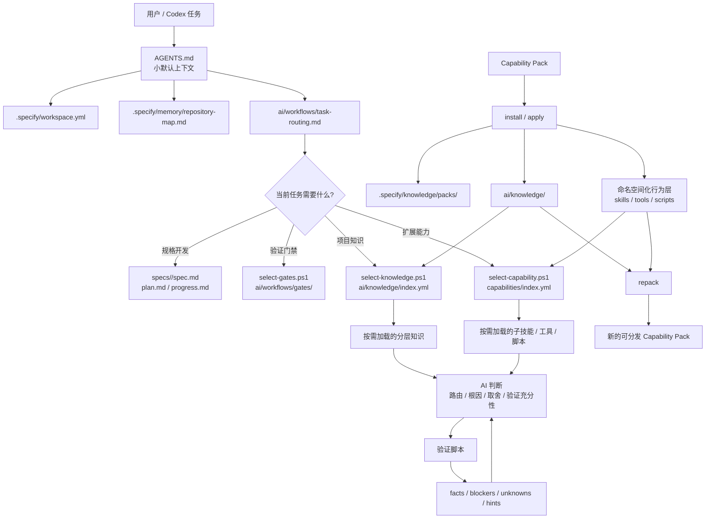

# Spec Kit

<p align="center">
  <a href="https://github.com/liuminxin45/spec-kit"></a>
  
  
  <a href="LICENSE"></a>
</p>

Spec Kit 是一个面向 Codex 的 AI Coding 工作流脚手架。它提供 CLI、模板、阶段技能、验证脚本、知识索引和知识包生命周期能力，用来把“规格驱动开发”和“项目知识按需加载”组织成一套可复制的工程流程。

它不把某个团队、业务或仓库的知识写死在开源核心里。开源核心只保留通用工作流；项目事实、团队规则、仓库结构、领域约束和定制技能应放在目标项目本地 `ai/knowledge/`，或打成可挂载、可更新、可卸载、可重新打包的 capability pack。

## 开源声明

本项目借鉴了 GitHub 官方 [github/spec-kit](https://github.com/github/spec-kit) 的源码结构和 Spec-Driven Development 工作流思想，并在此基础上面向 Codex、分层知识库、capability pack、项目资产升级和自动化门禁做了工程化扩展。本仓库不是 GitHub 官方项目；若上游项目许可证或声明有更新，应以其官方仓库为准。

## 功能特点

- **Codex-only 初始化**：`specify init --here` 会安装 Codex 入口 skill、内部阶段 skills 和 Spec Kit 共享资产。
- **小默认上下文**：默认入口只要求读取稳定的 workspace、repository map 和 task routing，具体知识按任务再加载。
- **分层工作流重量**：支持 `micro-fix`、`standard-bugfix-lite`、`standard-bugfix`、`full-sdd`、`blocked-investigation` 和 `validation-only`，让小修复不被重流程拖慢，高风险交付仍走硬门禁。
- **确定性阶段路由**：`resolve-next-stage.ps1` 根据 feature state、workflow state、artifacts 和 gate 结果输出下一阶段 JSON，Agent 不靠自然语言猜下一步。
- **可选门禁包**：`select-gates.ps1` 按 stage、affected repositories、risk flags、capability tags 和 terms 选择 host CDP、native bridge、plugin package、real-device 等 gate pack。
- **分层知识库**：`ai/knowledge/index.yml` 配合 `select-knowledge.ps1`，让 AI 只读取当前任务需要的 guide。
- **知识包挂载**：支持把 `ai/knowledge/`、skills、tools、scripts、commands、profiles 和 evaluation 组成独立 pack。
- **AI 辅助知识包生成**：`generate-knowledge-pack.ps1` 负责确定性扫描和质量产物，AI 负责语义阅读、整理、标注未知项和补 source refs。
- **生命周期完整**：已有 pack 可以挂载、更新、卸载；用户在项目中补充后的知识也可以 repack 后继续分发。
- **可审计 pack 来源**：pack 安装会记录 `install-record`、文件清单、树哈希和 lock，更新/卸载都有机器可读事实。
- **工作流闭环**：AI 自验、convergence、人工验收、retrospective、workflow observer、commit、post-commit self-check、rubric-score 和 complete-branch 串成固定闭环；workflow run/status 支持 JSON。
- **工程化验证**：提供 generated context、knowledge index、context budget、pack schema、synthesis quality、semantic equivalence、push preflight 和 release version 相关脚本。

## 架构图



## 快速开始

### 1. 环境要求

- Python 3.11+
- PowerShell
- Git
- Codex

### 2. 安装 CLI

在 Spec Kit 仓库根目录执行：

```powershell
pwsh -NoProfile -File .\scripts\powershell\install.ps1
```

安装后会注册 `specify` 命令，对应 Python package `specify-cli`。

### 3. 初始化目标项目

进入目标项目根目录：

```powershell
specify init --here
```

初始化后会生成或刷新这些资产：

```text
AGENTS.md
.agents/
.specify/
ai/
specs/
```

然后在 Codex 中从入口 skill 开始：

```text
$speckit-specify
```

## 使用已有知识包开局

如果已经有可分发知识包，可以在初始化时直接挂载：

```powershell
specify init --here --knowledge-pack <pack-dir>
```

这会安装 pack、物化 `ai/knowledge/`、写入 `.specify/knowledge/lock.yml`，并验证知识索引。因为知识来自外部 pack，这条路径 does not generate an AI review packet。

如果 pack 明确要定义目标项目的 workspace profile 和 repository map，再加：

```powershell
specify init --here --knowledge-pack <pack-dir> --knowledge-pack-apply-profiles
```

不加 `--knowledge-pack-apply-profiles` 时，Spec Kit 会保留初始化生成的 `.specify/workspace.yml` 和 `.specify/memory/repository-map.md`。

初始化后也可以显式挂载或更新 pack：

```powershell
specify knowledge apply-pack <pack-dir> --project-dir <project-dir> --force
specify knowledge update-pack <pack-dir> --project-dir <project-dir>
specify knowledge uninstall-pack <pack-id> --project-dir <project-dir>
```

安装后的审计记录位于：

```text
.specify/knowledge/records/<pack-id>.json
.specify/knowledge/records/index.json
.specify/knowledge/lock.yml
.specify/capabilities/lock.yml
```

其中 `records/<pack-id>.json` 记录来源、manifest、trust、文件 SHA-256 清单和 `tree_sha256`；`lock.yml` 记录当前 active pack 集合和对应安装记录。更新 pack 时会报告 `previous_tree_sha256`、`new_tree_sha256` 和 `tree_changed`，卸载 pack 时会同步移除安装记录和已发布能力层。

## 没有知识包时开局

先初始化项目：

```powershell
specify init --here
```

再生成一版可审查的草稿知识库：

```powershell
specify knowledge bootstrap --project-dir . --json
```

输出目录：

```text
.specify/knowledge-bootstrap/draft/ai/knowledge/
.specify/knowledge-bootstrap/ai-review/
```

`.specify/knowledge-bootstrap/ai-review/` 用于记录 source-read plan 和 claim ledger。AI 应按计划补充 source refs、未知项和分层知识，而不是把机械扫描结果直接当作高质量知识库。

## 用 AI 生成知识包

对一个已有项目或多仓 workspace，可以运行 AI-assisted generator：

```powershell
specify knowledge generate-pack --project-dir . --pack-id <id> --include-profiles --json
```

生成器会创建：

```text
.specify/knowledge-pack-generation/ai-synthesis/ai/knowledge/
.specify/knowledge-pack-generation/ai-pack-generator/generation-contract.json
.specify/knowledge-pack-generation/ai-pack-generator/source-read-queue.md
.specify/knowledge-pack-generation/quality/
.specify/knowledge-pack-generation/equivalence/
.specify/knowledge-pack-generation/pack/<id>/
```

AI 完成 `.specify/knowledge-pack-generation/ai-synthesis/ai/knowledge/` 后，用 reviewed knowledge 重新导出：

```powershell
specify knowledge finalize-pack --project-dir . --pack-id <id> --include-profiles --json
```

如果希望 finalize 后立即挂载到当前项目：

```powershell
specify knowledge finalize-pack --project-dir . --pack-id <id> --include-profiles --apply --force
```

质量闭环会写出：

```text
.specify/knowledge-pack-generation/quality/source-coverage-ledger.json
.specify/knowledge-pack-generation/quality/claim-verification-report.json
.specify/knowledge-pack-generation/quality/synthesis-quality-summary.md
.specify/knowledge-pack-generation/equivalence/equivalence-summary.md
```

也可以单独评估 synthesis 质量：

```powershell
specify knowledge evaluate-synthesis --project-dir . --minimum-score 70 --fail-below-minimum --json
```

CLI 命令是推荐入口；底层仍由 `.specify/scripts/powershell/bootstrap-knowledge.ps1`、`generate-knowledge-pack.ps1`、`evaluate-knowledge-pack-synthesis.ps1` 和 `validate-knowledge-pack.ps1` 执行确定性扫描、导出和门禁，便于排障和流水线复用。

## 知识包结构

一个 capability pack 可以包含这些层：

```text
knowledge-pack/
├── knowledge-pack.yml
├── ai/knowledge/
├── capabilities/index.yml
├── skills/
├── tools/
├── scripts/
├── commands/
├── prompts/
├── resources/
├── profiles/
└── evaluation/
```

各层含义：

| 层 | 作用 |
| --- | --- |
| `ai/knowledge/` | 分层项目知识、仓库地图、领域规则、工具约束。 |
| `capabilities/index.yml` | 注册 pack 暴露的 skills、tools、scripts、commands、prompts 和 resources。 |
| `skills/` | 命名空间化 Codex skills，按任务触发读取。 |
| `tools/` | MCP/tool 使用策略、验证工具约定和低频工具说明。 |
| `scripts/` | pack 自带脚本。脚本应输出 `facts`、`blockers`、`unknowns`、`hints`。 |
| `commands/` | pack 专属命令提示或工作流片段。 |
| `prompts/` | 可复用 prompt 模板。 |
| `resources/` | 大文档、示例、图和低频资料。 |
| `profiles/` | 可选的 `workspace.yml` 和 `repository-map.md`。 |
| `evaluation/` | 路由 canary、语义评估输入和 golden contract。 |

Pack 安装或 compose 时不会自动执行 pack scripts。行为层会发布到命名空间路径：

```text
.agents/spec-kit/skills/<pack-id>__<skill>
ai/tools/<pack-id>/
.specify/scripts/packs/<pack-id>/
```

## 生命周期命令

| 目标 | 命令 |
| --- | --- |
| 生成草稿知识库 | `specify knowledge bootstrap --project-dir . --json` |
| 挂载 pack | `specify knowledge apply-pack <pack-dir> --project-dir . --force --json` |
| 更新 pack | `specify knowledge update-pack <pack-dir> --project-dir . --json` |
| 卸载 pack | `specify knowledge uninstall-pack <id> --project-dir . --json` |
| 导出本地知识 | `specify knowledge export-pack --project-dir . --source-knowledge-dir ai/knowledge --pack-id <id> --output-dir <pack-dir> --force --json` |
| 提升 approved 知识候选 | `specify knowledge promote-candidates --project-dir . --feature-dir specs/<feature> --json` |
| 提升并增量重打包 | `specify knowledge promote-candidates --project-dir . --feature-dir specs/<feature> --repack --pack-id <id> --force --json` |
| 重新打包 | `specify knowledge repack --project-dir . --pack-id <id> --include-profiles --force --json` |
| 验证 pack | `specify knowledge validate-pack <pack-dir> --json` |
| 评估 AI synthesis | `specify knowledge evaluate-synthesis --project-dir . --minimum-score 70 --fail-below-minimum --json` |
| 选择能力层 | `select-capability.ps1 -RepoRoot . -Layer skills -Json` |
| 比较等效性 | `compare-knowledge-pack-equivalence.ps1 -SourceKnowledgeDir ai/knowledge -PackRoot <pack-dir> -Json` |

## 本地开发

不想先全局安装 CLI 时，可以从 Spec Kit 仓库根目录使用包装脚本初始化目标项目：

```powershell
pwsh -NoProfile -File .\scripts\powershell\init.ps1 -ProjectPath <project-dir> -SpecKitSourcePath .
```

常用选项：

| 参数 | 作用 |
| --- | --- |
| `-SkipInstall` | 复用当前已安装的 `specify`。 |
| `-NoForce` | 不强制覆盖已管理的共享资产。 |
| `-EditableInstall` | 以 editable 模式安装当前源码。 |
| `-ConfigureMcpAgent` | 显式写入 Codex MCP 配置。 |
| `-SkipMcpAgentConfig` | 即使传入 MCP 参数，也跳过 MCP 配置。 |

默认初始化不写 Codex MCP 配置；需要 Chrome DevTools MCP 时再显式开启。

## 项目级命令定位

`specify` 是全局 CLI，但作用对象是项目级 `.specify/`。命令定位顺序如下：

1. 显式 `--project-dir <dir>`。
2. 环境变量 `SPECIFY_INIT_DIR=<dir>`。
3. 从当前目录向上查找最近的 `.specify/`。
4. 找不到时才把当前目录视为候选并报错。

因此可以在 monorepo 子目录中运行：

```powershell
specify workflow status --json
specify knowledge apply-pack <pack-dir> --json
```

也可以从外部目录指定目标项目：

```powershell
$env:SPECIFY_INIT_DIR = "C:\path\to\your-project"
specify integration status --json
```

## Workflow 机器接口

工作流执行器会把 run state 保存到：

```text
.specify/workflows/runs/<run-id>/state.json
.specify/workflows/runs/<run-id>/inputs.json
.specify/workflows/runs/<run-id>/log.jsonl
```

常用命令：

```powershell
specify workflow run speckit --input spec="修复发现页状态" --json
specify workflow status <run-id> --json
specify workflow resume <run-id> --input risk_level=high --json
```

`speckit` 的阶段不由 Agent 自己猜。阶段 skill 应先消费确定性路由结果：

```powershell
pwsh -NoProfile -File .specify/scripts/powershell/resolve-next-stage.ps1 -RepoRoot . -FeatureDir specs/<feature> -Json
```

源码检出内调试时使用同名脚本：

```powershell
pwsh -NoProfile -File .\scripts\powershell\resolve-next-stage.ps1 -RepoRoot <project-dir> -FeatureDir <project-dir>\specs\<feature> -Json
```

`resolve-next-stage` 输出 `current_stage`、`next_stage`、`can_continue`、`blockers`、`required_human_action`、`commands_to_run` 和 `missing_artifacts`。Agent 继续执行下一阶段时，应执行脚本给出的 `next_stage`，而不是只报告“下一步应该做什么”。

当前内置 profile：

| Profile | 用途 | 核心 artifact |
| --- | --- | --- |
| `micro-fix` | 单仓、低风险、root cause 明确、可本地验证的 1-3 文件修复。 | `micro-fix.md` 或 `progress.md` |
| `standard-bugfix-lite` | 低/中风险标准修复的轻量路径。 | `workpack.md` |
| `standard-bugfix` | 需要 `spec.md` + `plan.md`，但不一定需要独立 `tasks.md` 的普通行为修复。 | `spec.md`、`plan.md` |
| `full-sdd` | public API、架构/协议、跨仓、迁移、真实设备或 host/plugin/native 交付链。 | `spec.md`、`plan.md`、`tasks.md` 和按需设计 artifact |
| `blocked-investigation` | root cause 或验证条件不清楚，先收集事实。 | `fact-pack.md` / investigation notes |
| `validation-only` | 只补验证证据，不改产品代码。 | `validation.md` |

常规代码改动的固定闭环是：

```text
intake -> specify -> plan -> implement -> converge -> acceptance
-> human-acceptance -> retrospective -> workflow-observer -> commit
-> post-commit-self-check -> rubric-score -> complete-branch
```

其中 `post-commit-self-check -> rubric-score -> complete-branch` 是 commit 后固定链路。`complete-branch` 会改变本地分支状态，必须有人类确认；push 不属于默认交付链，开源仓库应优先走 PR，并在 push 前运行 `preflight-push`。

## Spec Persistence 策略

`.specify/workspace.yml` 支持 `spec_persistence`：

```yaml
spec_persistence:
  model: "flow-back"
  keep_feature_artifacts: true
  promote_only_with_human_approval: true
  durable_knowledge_target: "ai/knowledge"
  repack_after_approved_promotion: false
```

当前默认是 `flow-back`：feature artifacts 保留为交付证据，长期经验通过 retrospective 生成候选，只有人工批准后才写入 `ai/knowledge`，需要分发时再 repack。后续项目也可以约定 `flow-forward` 或 `living-spec`，但必须先在 workspace policy 中显式声明。

## Integration 诊断

当前开源版是 Codex-only。可以检查项目里的集成状态和关键路径：

```powershell
specify integration status --json
```

输出包含默认集成、已安装集成、`AGENTS.md`、`.agents/skills`、`.agents/spec-kit/skills` 等路径是否存在，便于升级或初始化后做诊断。

## 版本与发布

Spec Kit 核心版本以 `pyproject.toml` 的 `[project].version` 为唯一来源。CLI 的 `specify self check` 会读取已安装的 `specify-cli` 分发版本；源码检出场景下保留 `pyproject.toml` 回退读取。当前开源版不实现远端自动升级，`specify self upgrade` 只提示用户按仓库发布方式升级。

读取当前版本：

```powershell
pwsh -NoProfile -File .\scripts\powershell\get-spec-kit-version.ps1 -Json
```

校验版本机制：

```powershell
pwsh -NoProfile -File .\scripts\powershell\validate-spec-kit-version.ps1 -Json
```

升版：

```powershell
pwsh -NoProfile -File .\scripts\powershell\bump-spec-kit-version.ps1 -Version <x.y.z> -Json
```

推荐发布顺序：

1. 使用 `bump-spec-kit-version.ps1` 修改版本号。
2. 更新 README / TEAM-README / 模板说明，确保文档描述与最新 workflow、脚本和升级路径一致。
3. 运行 `validate-spec-kit-version.ps1`、generated context / knowledge / context budget 校验和仓库测试。
4. 通过 PR 合入默认分支 `main`。不建议直接 push `main`；不建议 squash 掉需要被下游 lock 追溯的 release 提交。
5. 在本地切到最新 `main`，确认 release 提交已经包含版本号、README 和脚本改动。
6. 基于该 `main` 提交创建 `v<x.y.z>` 标签并推送。

发布 tag 示例：

```powershell
git switch main
git pull --ff-only origin main
pwsh -NoProfile -File .\scripts\powershell\validate-spec-kit-version.ps1 -Json
python -m pytest -q
git tag -a v<x.y.z> -m "Spec Kit <x.y.z>"
git push origin v<x.y.z>
```

如果 README 或 release note 还需要补丁，应先新起分支、PR 合入 `main`，再打 tag。不要在缺少 README 修正的旧 `main` 提交上提前打 release tag。

## 项目资产升级

CLI 本体升级、目标项目资产升级、Codex integration 技能升级是三条链路。
只升级 CLI 会导致命令版本是新的，但项目内 `.specify`、`ai/**` 或
`.agents/**` 仍停留在旧版本。先用 self check 看完整状态：

```powershell
specify self check --project-dir . --json
```

输出中的 `project.assets` 和 `project.integrations` 必须都显示
`status: current`，才表示项目真正完成升级。

- `specify self check`：查看当前安装的 CLI 版本。
- `specify self upgrade`：保留的自升级入口，当前版本不自动联网升级。
- `specify upgrade`：在目标项目根目录刷新 Spec Kit 管理的脚本、模板、AI 工作流资产、checklist rules 和 bundled workflow。
- `specify integration upgrade codex --force`：刷新 Codex 入口技能和内部阶段技能。

先预览升级计划：

```powershell
specify upgrade --project-dir <project-dir> --dry-run
```

如果 `self check` 或 `upgrade --dry-run --json` 报告 integration 版本旧，
继续执行：

```powershell
specify integration upgrade codex --force
```

应用当前已安装版本的项目资产：

```powershell
specify upgrade --project-dir <project-dir>
```

从本地 Spec Kit 源码检出升级项目资产：

```powershell
specify upgrade --project-dir <project-dir> --source <spec-kit-source-dir>
```

约束目标版本，避免误用其它源码检出：

```powershell
specify upgrade --version <x.y.z>
```

升级会写入：

```text
.specify/spec-kit.lock.yml
.specify/integrations/speckit.manifest.json
```

`spec-kit.lock.yml` 记录当前项目使用的 Spec Kit 版本、来源和 managed asset manifest；`speckit.manifest.json` 记录由 Spec Kit 管理的文件 hash。默认只刷新未被用户修改过的 managed assets；用户改过的文件会被保留并在计划里报告。确实需要覆盖时再使用：

```powershell
specify upgrade --force
```

升级后默认运行 `validate-generated-context`、`validate-knowledge-index` 和 `validate-context-budget`。只想同步资产、不跑门禁时使用：

```powershell
specify upgrade --skip-validation
```

## 验证

在目标项目安装态修改生成上下文、知识索引、模板、脚本或 pack 后，至少运行：

```powershell
pwsh -NoProfile -File .specify/scripts/powershell/automation-common.ps1 -Tool validate-generated-context -RepoRoot . -Json
pwsh -NoProfile -File .specify/scripts/powershell/automation-common.ps1 -Tool validate-knowledge-index -RepoRoot . -Json
pwsh -NoProfile -File .specify/scripts/powershell/automation-common.ps1 -Tool validate-context-budget -RepoRoot . -Json
```

开发 Spec Kit 源仓库本身时运行：

```powershell
pwsh -NoProfile -File .\scripts\powershell\validate-generated-context.ps1 -RepoRoot . -Json
pwsh -NoProfile -File .\scripts\powershell\validate-knowledge-index.ps1 -RepoRoot . -Json
pwsh -NoProfile -File .\scripts\powershell\validate-context-budget.ps1 -RepoRoot . -Json
python -m pytest -q
```

`validate-context-budget` 的 near-budget 超阈值是 warning，不阻塞普通交付；release 或流程优化任务应记录处理结论，避免长期无人负责。

README 与知识包开局文档相关回归：

```powershell
python -m pytest tests/test_spec_delivery_workflow.py::test_open_source_readme_documents_pack_and_generated_knowledge_starts -q
```

## 项目结构

```text
src/specify_cli/        specify CLI 源码
scripts/powershell/     初始化、验证、知识包和工作流脚本
templates/              初始化模板、命令模板、AI 资产和内置 skills
workflows/              bundled workflow 定义
checklist-rules/        checklist 规则包
config/                 配置模板
tests/                  回归测试
TEAM-README.md          团队内部流程说明，默认不进入任务上下文
```

## FAQ

### 这个仓库会包含项目私有知识吗？

不应该包含。开源核心只放通用框架资产。Project-specific facts belong in workspace-local `ai/knowledge/` or portable capability packs.

### bootstrap 和 generate-knowledge-pack 有什么区别？

`specify knowledge bootstrap --project-dir . --json` 更适合没有 pack 时快速生成草稿知识库和 AI review packet。`specify knowledge generate-pack --project-dir . --pack-id <id> --json` 面向可分发 pack，会生成 synthesis workspace、质量报告、等效性产物和 pack 目录。

### 知识包挂载后还能继续演进吗？

可以。用户在目标项目中补充或修正知识后，可以用 `repack-knowledge-pack.ps1` 把当前知识层重新打包，便于分发给其它项目或团队。
推荐入口是 `specify knowledge repack --project-dir . --pack-id <id> --include-profiles --force --json`。

### Pack scripts 会在安装时自动执行吗？

不会。安装和 compose 只发布命名空间化资产；脚本需要由 AI 或用户在明确任务中按需调用。

### 为什么要保留小默认上下文？

AI Coding 的问题通常不是缺少知识，而是旧知识、无关知识和过量上下文污染判断。Spec Kit 的默认入口只加载稳定事实，再通过 selector 按需加载 feature artifacts、knowledge guides、gate packs 和 capability behavior。

## 路线图

当前仓库已经包含知识包生命周期、AI-assisted generator、synthesis quality 和 semantic equivalence 相关脚本。后续演进应围绕这些已有能力继续收敛：

- 强化随机项目的 AI pack generation 质量闭环。
- 扩展 pack evaluation contract 的可复用样例。
- 增强多 pack compose、更新和 repack 的冲突诊断。
- 继续压缩默认上下文，让更多低频知识进入按需加载层。

## License

本仓库使用 [MIT License](LICENSE)。
